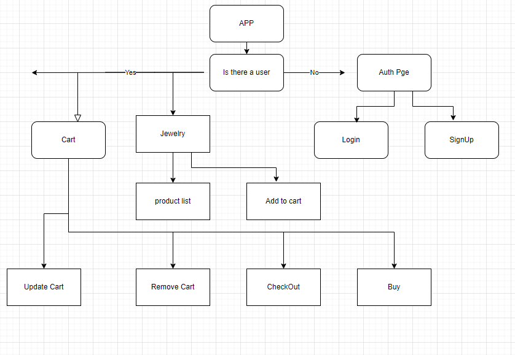
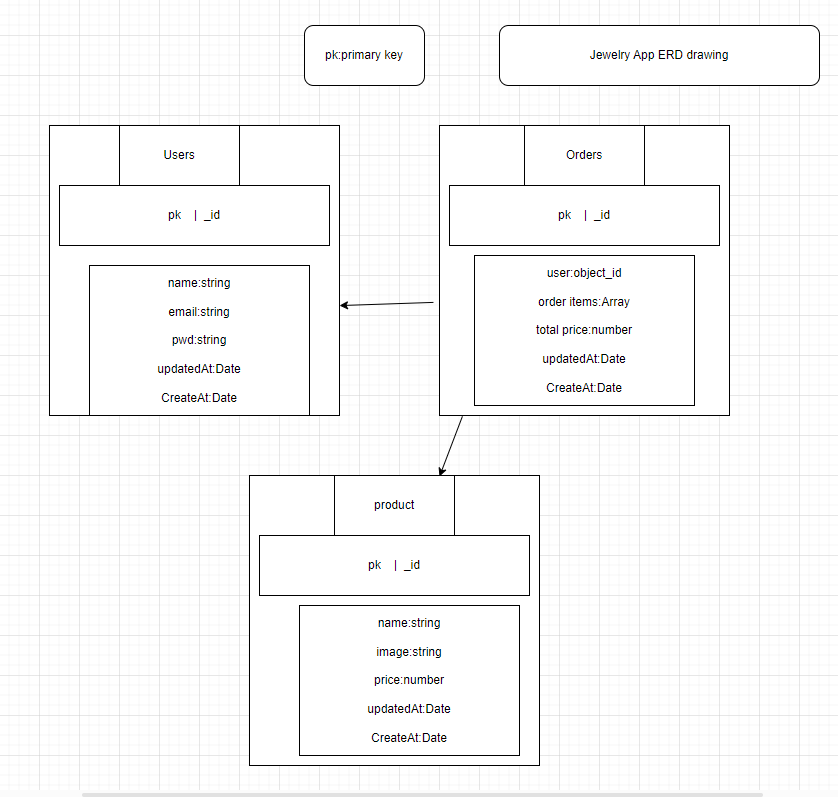
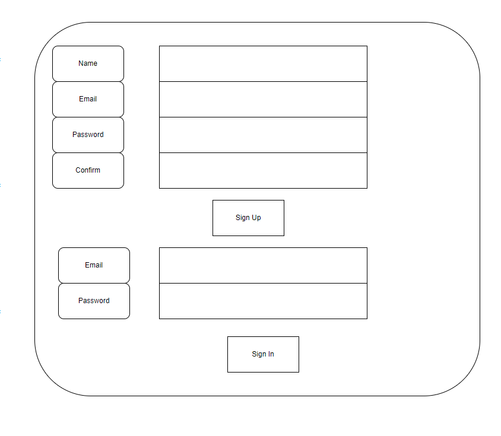
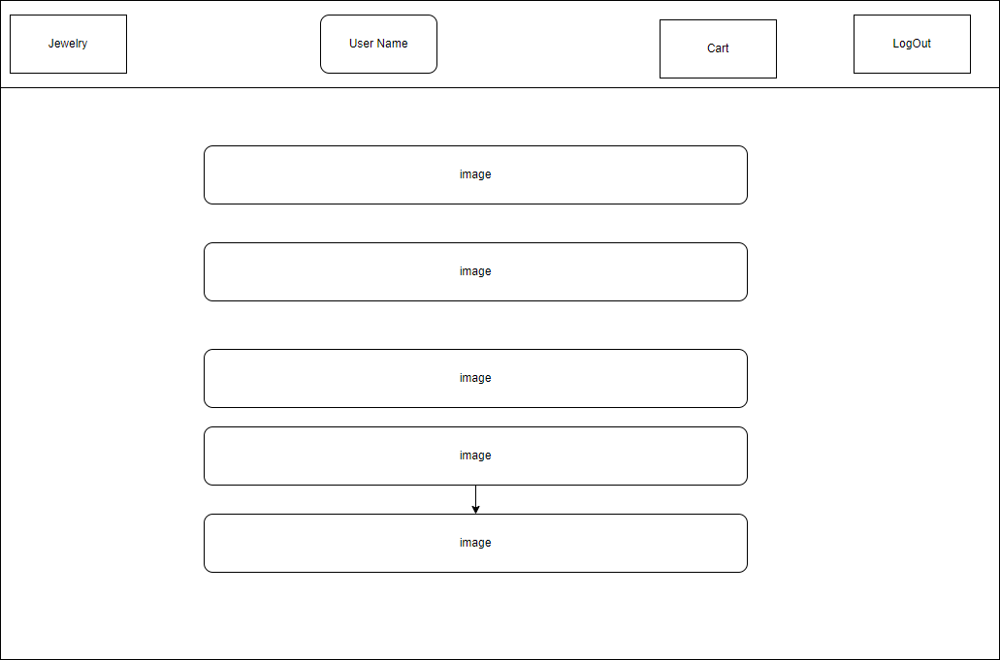
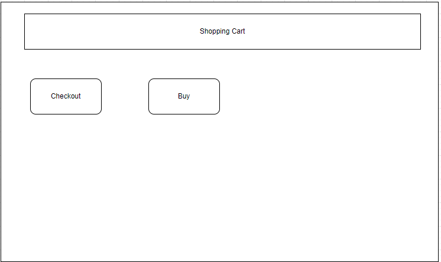

# Jewelry App

# Features

1. display a list of jewelry products

2. Add products to the shopping cart.

3. view and manage shopping cart.

4. checkout and place orders.

# Flowchart

# ERD diagram

# Wireframes

1. Authentication page

2. Jewelry Page

3. Cart Page

# Project planning

https://trello.com/b/wvedMOqL/jewelry-mern-project

# github repository

https://github.com/PriyankaSagam/Final-Project.git

# Technologies

1. frontend---------REACT
2. backend---------EXPRESS JS,NODE JS
3. database--------MONGODB

# Backend (Node.js and Express):
1. bcrypt (v5.1.1): Library for hashing passwords.
2. cors (v2.8.5): Middleware for enabling Cross-Origin Resource Sharing.
3. dotenv (v16.3.1): Loads environment variables from a .env file.
4. express (v4.18.2): Web application framework for Node.js.
5. jsonwebtoken (v9.0.2): Library for generating and verifying JSON Web Tokens.
5. mongoose (v8.0.3): MongoDB object modeling for Node.js.
6. morgan (v1.10.0): HTTP request logger middleware for Node.js.
7. serve-favicon (v2.5.0): Middleware for serving a favicon.
# Frontend (React):
1. react (v18.2.0): JavaScript library for building user interfaces.
2. react-dom (v18.2.0): Provides DOM-specific methods for React.
3. react-router-dom (v6.21.1): Routing library for React applications.

# browser--

1. localhost:3001-----backend
2. localhost:5173-----frontend

# Images

https://pixabay.com/

# Deployed link

https://final-project-t52m.onrender.com

